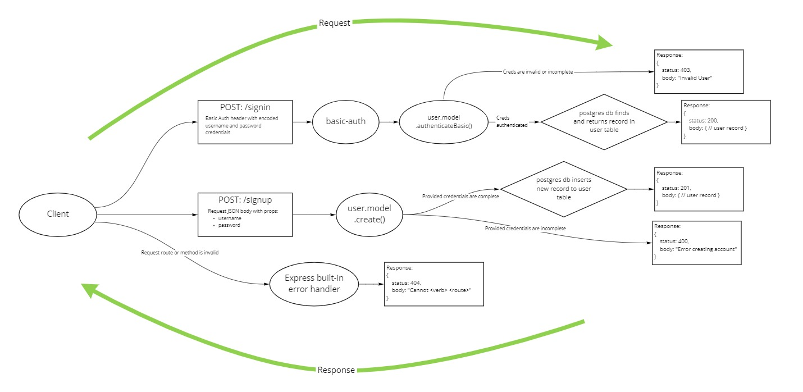

<!--  This is a template repo -->
# my project

An Express server that implements Basic Authentication, with signup and signin capabilities, using a Postgres database for storage.

<!-- Insert links to deploy(s) here -->
[Deployed API](https://jjtech-basic-auth.herokuapp.com/)

<!-- Insert UML diagram here -->

## Installation

1. Clone from this repo `git clone https://github.com/jeffreyjtech/basic-auth.git`.
2. `cd` into `basic-auth`
3. Run `npm install`
4. Optionally, create an .env file with variable `PORT` to run the API on your preferred port number. The default port is `3000`.

## Usage

After installation, run `npm start`.

## Contributors / Authors

- Jeffrey Jenkins

## Features / Routes

### Routes

#### `/signup`

- POST : `/signup` : Creates a user account
  - Request body
    - Requires a JSON body with username and password properties
      - `{ username: <your-username>, password: <your-password> }`
  - Response
    - status `201`, and a JSON body with the newly created user record.
    - status `400` if user account could not be created.

#### `/signin`

- POST : `/signin` : Logs into a user account
  - Headers
    - Requires an `authorization` header with base-64 encoded username and password.
      - `<username>:<password>` -> encode in base-64 -> `Basic <encodedAuthString>`
  - Response
    - status `200`, and a JSON body with the signed-in user record
    - status `403` if either the username or password are invalid.
